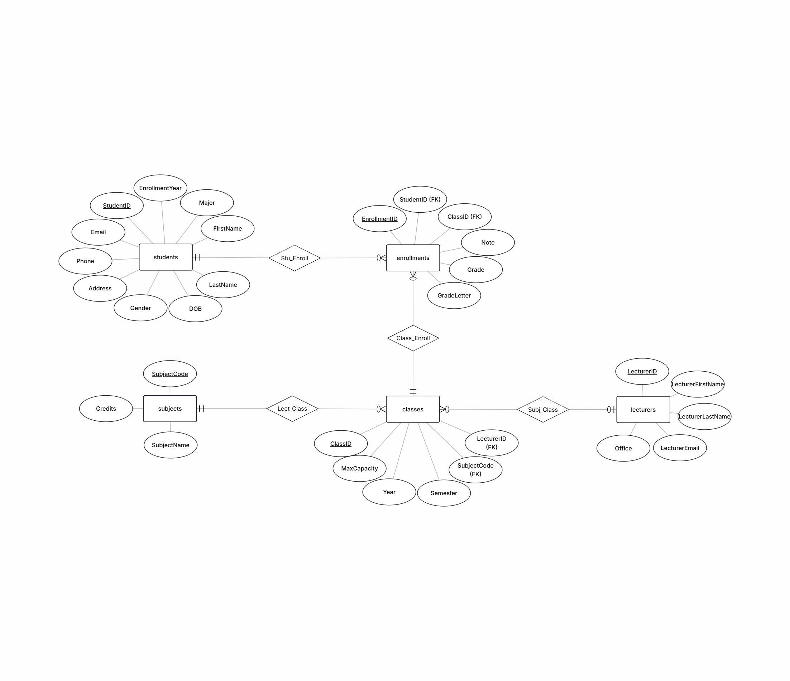

# Student Information Manager 🎓

A desktop-based academic management system developed for the **Introduction to Databases** course at **National Economics University (NEU)**.  
The project covers the full workflow from database normalization (**UNF → 3NF**) to MySQL implementation and a Python GUI application.

---

## 📌 Overview

**Student Information Manager** is designed to manage academic data in a structured, consistent, and reliable manner.  
The system replaces manual or spreadsheet-based record keeping by combining a normalized relational database with a simple graphical user interface.

This project demonstrates:
- Full database normalization up to **Third Normal Form (3NF)**
- A clean relational schema with strong referential integrity
- Practical **CRUD** operations on MySQL
- A user-friendly desktop GUI built with Tkinter
- Analytical SQL queries and dashboard-style insights

---

## ✨ Features

- **Student Management**: Add, edit, delete, and search student records  
- **Lecturer Management**: Manage lecturer information and teaching assignments  
- **Subject & Class Management**: Define subjects and manage class offerings  
- **Enrollment Management**: Enroll students into classes with enforced integrity constraints  
- **SQL Queries & Reports**: Multi-table `JOIN` queries for academic analysis  
- **Dashboard**: Overview metrics, grade distribution, and top-performing students  
- **Error Handling**: Clear warnings for invalid actions (e.g., no record selected, invalid input)

---

## 🛠 Technology Stack

- Programming Language: **Python 3.10+**
- GUI Framework: **Tkinter**
- Database: **MySQL 8.0+**
- Database Connector: **mysql-connector-python**
- Architecture: **Layered / MVC-inspired**

---

## 🗄 Database Design

The database schema is rigorously normalized to **Third Normal Form (3NF)** to eliminate redundancy and prevent update anomalies.

Core tables:
- Students
- Lecturers
- Subjects
- Classes
- Enrollments

Primary keys, foreign keys, and constraints ensure data consistency and referential integrity.

---

## 🚀 Installation & Setup

### Prerequisites
- Python 3.10 or higher
- MySQL Server 8.0 or higher

### Setup Instructions
Clone the repository using  
`git clone https://github.com/YOUR_USERNAME/student-information-manager.git`  
then move into the project directory with  
`cd student-information-manager`.

Install dependencies using  
`pip install -r requirements.txt`.

Open MySQL Workbench (or another MySQL client), run `schema.sql` to create tables and constraints, then run `seed.sql` to insert sample data.  
Update database credentials in `app/db/connection.py`.

Finally, start the application with  
`python main.py`.

The GUI window will open after a successful database connection.

---

## 📸 Screenshots

- Dashboard overview

- Student management interface  
- Enrollment management  
- Error handling examples  

(See the `assets/` folder for full screenshots.)

---

## 👥 Authors

**Group Project – National Economics University (NEU)**  
Course: *Introduction to Databases*

- Nguyen Van Tue — 11247366  
- Pham Huy Thanh — 11247351  
- Le Duy Quyen — 11247345  

Instructor: **Dr. Tran Hung**
